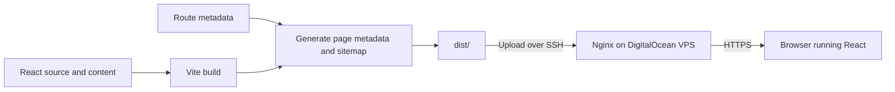

# Roger Belman | Portfolio

My personal portfolio website, built to present my software engineering projects, professional experience, and resume in one place. The project combines a responsive React interface with route-specific SEO metadata and deployment to an Ubuntu VPS on DigitalOcean.

**[View the live website](https://rogerbelman.com/)** · **[Projects](https://rogerbelman.com/projects)** · **[LinkedIn](https://www.linkedin.com/in/roger-belman/)**

Nginx serves the production build over HTTPS on the custom domain `rogerbelman.com`.

[Features](#features) · [Architecture](#architecture) · [Run locally](#run-locally) · [Deployment](#deployment) · [Updating content](#updating-content)

## Features

- Responsive layouts for desktop and mobile screens.
- Profile, projects, and experience pages with shared navigation and active route indicators.
- Navigation that hides while scrolling down and reappears when scrolling up.
- Reusable project and experience cards populated from separate JavaScript data files.
- PDF resume access and links to GitHub, LinkedIn, and project websites.
- Page-specific metadata, social sharing previews, structured data, and a generated sitemap.
- Canonical URL redirects and a custom not-found page, with production HTTP status handling in Nginx.

| Page | Route | Content |
| --- | --- | --- |
| Profile | `/` | Introduction, profile photo, social links, and resume |
| Projects | `/projects` | Project descriptions, technologies, and external links |
| Experience | `/experience` | Professional roles, skills, and responsibilities |

## Tech Stack

| Area | Technology |
| --- | --- |
| User interface | React 18, JavaScript, HTML, CSS |
| Routing | React Router 7 |
| Development and builds | Vite 8 |
| Code quality | ESLint 9 |
| Hosting | DigitalOcean VPS running Ubuntu |
| Web server | Nginx |
| HTTPS | Let's Encrypt certificates managed with Certbot |

## Architecture

The application is a React single-page app served as static files. React Router selects the page, and a shared layout provides navigation and the footer. Project and experience content lives in data files so it can be updated without changing the card components.



### SEO and route handling

[`src/routes/routeMeta.js`](src/routes/routeMeta.js) centralizes page titles, descriptions, canonical paths, and sitemap settings. Two parts of the application use it:

- **During the build:** [`scripts/prerender-routes.mjs`](scripts/prerender-routes.mjs) writes route-specific HTML metadata and generates `sitemap.xml`.
- **During navigation:** [`src/components/SEO.jsx`](src/components/SEO.jsx) updates the document title, canonical URL, description, Open Graph tags, Twitter Card tags, and robots directives.

The HTML template also includes JSON-LD `Person` structured data. The not-found page uses `noindex, nofollow`.

The generated HTML makes metadata available before JavaScript runs. Page content is rendered by React in the browser; the build script does not perform full-page server rendering.

## Run Locally

### Prerequisites

- Node.js **22.12 or newer** and npm. The locked Vite dependencies also accept Node.js 20.19 or newer within the Node.js 20 release line.
- Git to clone the repository.

```bash
git clone https://github.com/RogerBelman/Portfolio-Website.git
cd Portfolio-Website
npm ci
npm run dev
```

Open the local URL printed by Vite, normally `http://localhost:5173`. No environment variables, API keys, or database setup are required.

## Available Commands

| Command | Purpose |
| --- | --- |
| `npm run dev` | Start the development server with hot reload. |
| `npm run build` | Build the site and generate route-specific HTML metadata and a sitemap in `dist/`. |
| `npm run preview` | Preview the production build locally after running the build command. |
| `npm run lint` | Check JavaScript and JSX files with ESLint. |

## Production Build

```bash
npm run lint
npm run build
npm run preview
```

The build command runs Vite followed by the metadata generation script. The output is ready to serve as static files:

```text
dist/
├── assets/                 # Bundled JavaScript, CSS, and imported images
├── images/                 # Public images and favicons
├── index.html              # Profile page metadata
├── projects/index.html     # Projects page metadata
├── experience/index.html   # Experience page metadata
├── 404.html                # Not-found metadata and application entry point
├── Resume_Roger_Belman.pdf
├── robots.txt
└── sitemap.xml             # Generated from routeMeta.js
```

Use the preview server to check the production frontend locally. Nginx redirects, TLS, and HTTP status codes must be checked on the deployed server. There is currently no automated test suite configured.

## Deployment

### Hosting setup

The deployment workflow builds the application locally and uploads `dist/` to an **Ubuntu VPS on DigitalOcean**. **Nginx** serves those files, and **Certbot / Let's Encrypt** provides HTTPS for the custom domain. Node.js is needed on the build machine; Nginx serves the deployed files without a Node.js application process.

The canonical site URL is `https://rogerbelman.com`. The server routing design is:

| Request | Expected response |
| --- | --- |
| `/`, `/projects`, `/experience` | `200` with the corresponding generated HTML |
| HTTP or the `www` hostname | `301` to the canonical HTTPS domain |
| `/Projects`, `/Experience`, or trailing slashes on these routes | `301` to the lowercase route without a trailing slash |
| `/profile` or `/Profile` | `301` to `/` |
| `/robots.txt`, `/sitemap.xml`, and existing static assets | `200` |
| An unknown URL | `404` with the custom not-found page |

The React router also handles legacy profile and capitalized page paths during client-side navigation. Nginx handles redirects and status codes for direct requests.

<details>
<summary><strong>Nginx routing reference</strong></summary>

These directives belong inside the canonical domain's Nginx `server` block, alongside its HTTPS configuration. Set `root` to the directory containing the uploaded build. Configure HTTP and `www` redirects in separate server blocks pointing to `https://rogerbelman.com$request_uri`.

```nginx
root /var/www/rogerbelman.com;
index index.html;
error_page 404 /404.html;

location = / {
    try_files /index.html =404;
}

location = /projects {
    try_files /projects/index.html =404;
}

location = /experience {
    try_files /experience/index.html =404;
}

# Exact canonical routes above take precedence over these redirects.
location ~* ^/projects/?$ {
    return 301 /projects;
}

location ~* ^/experience/?$ {
    return 301 /experience;
}

location ~* ^/profile/?$ {
    return 301 /;
}

location = /404.html {
    internal;
}

location / {
    try_files $uri $uri/ =404;
}
```

Explicit route handlers serve each page's generated metadata. The `=404` fallback preserves an actual HTTP 404 response for unknown paths while displaying the custom page.

After changing server configuration, validate it with `sudo nginx -t` before running `sudo systemctl reload nginx`.

</details>

### Deploy an update

These commands assume the VPS already has DNS, Nginx, HTTPS, and a writable site directory configured. Replace `YOUR_DEPLOY_USER`, `YOUR_DROPLET_IP`, and the destination path with your deployment values.

From the local repository root:

```bash
npm ci
npm run lint
npm run build
scp -r dist/* YOUR_DEPLOY_USER@YOUR_DROPLET_IP:/var/www/rogerbelman.com/
```

Upload the **contents** of `dist/` so `index.html` sits directly in the web root. This copies new files and overwrites matching files; it does not remove older assets. Nginx only needs a reload when its configuration changes.

### Verify a deployment

Check the profile, projects, experience, resume, and not-found page in a browser, including a direct page load and refresh on `/projects` and `/experience`.

Use the following commands to inspect the server's responses. In Windows PowerShell, use `curl.exe` if `curl` resolves to a PowerShell alias.

```bash
curl -I https://rogerbelman.com/projects
curl -I https://rogerbelman.com/experience
curl -I http://rogerbelman.com/
curl -I https://www.rogerbelman.com/
curl -I https://rogerbelman.com/Projects
curl -I https://rogerbelman.com/experience/
curl -I https://rogerbelman.com/sitemap.xml
curl -I https://rogerbelman.com/robots.txt
curl -I https://rogerbelman.com/missing-page
curl -I -L --max-redirs 5 https://www.rogerbelman.com/Projects
```

Compare the status codes and `Location` headers with the routing table above. The final command should reach the projects page with a `200` response and no redirect loop.

## Project Structure

```text
portfolio-website/
├── public/                     # Resume, images, favicons, and crawler files
├── scripts/
│   └── prerender-routes.mjs     # Generate page metadata, 404 HTML, and sitemap
├── src/
│   ├── assets/                 # Imported images and social icons
│   ├── components/             # Shared UI and page-specific components
│   ├── data/
│   │   ├── projects.js         # Project content
│   │   └── experiences.js      # Work experience content
│   ├── layout/                 # Shared navigation, main content, and footer
│   ├── pages/                  # Profile, projects, experience, and not-found pages
│   ├── routes/routeMeta.js      # Page metadata and sitemap settings
│   ├── App.jsx                # Route definitions
│   ├── index.css              # Global styles
│   └── main.jsx               # Application entry point
├── index.html                 # HTML template and structured data
├── eslint.config.js
├── package.json
└── vite.config.js
```

## Updating Content

| Content | File |
| --- | --- |
| Projects | [`src/data/projects.js`](src/data/projects.js) |
| Work experience | [`src/data/experiences.js`](src/data/experiences.js) |
| Profile introduction | [`src/components/profile/ProfileBody.jsx`](src/components/profile/ProfileBody.jsx) |
| Social links | [`src/components/profile/Socials.jsx`](src/components/profile/Socials.jsx) |
| Resume PDF | [`public/Resume_Roger_Belman.pdf`](public/Resume_Roger_Belman.pdf) |
| Profile and social preview image | [`public/images/profile-preview.jpg`](public/images/profile-preview.jpg) |
| Page metadata and sitemap dates | [`src/routes/routeMeta.js`](src/routes/routeMeta.js) |
| Footer text | [`src/layout/SiteLayout.jsx`](src/layout/SiteLayout.jsx) |

To add a project, append an object to the array in `src/data/projects.js`:

```js
{
    name: 'Project Name',
    skills: 'React, JavaScript, CSS',
    link: 'https://example.com',
    linkText: 'Visit Website',
    description: [
        'What the project does.',
        'What you built or contributed.',
    ],
    image: null,
},
```

Set `link` or `image` to `null` to omit the corresponding element. Images placed in `public/images/` can be referenced as `/images/filename.jpg`.

When changing content, review the corresponding description and `lastmod` date in `src/routes/routeMeta.js`, then rebuild before deploying. Replacing the resume with the same filename preserves its existing link.

If adapting the site for another domain or person, update the identity and URL values in `src/routes/routeMeta.js`, the metadata and structured data in `index.html`, and `public/robots.txt`. Update or remove the existing Google site-verification tag. Keep the source `public/sitemap.xml` consistent as well; the production sitemap is regenerated from route metadata during each build.

## Contact

**Roger Belman** — Software Engineering graduate, The University of Texas at Dallas.

- [Portfolio](https://rogerbelman.com/)
- [GitHub](https://github.com/RogerBelman)
- [LinkedIn](https://www.linkedin.com/in/roger-belman/)
